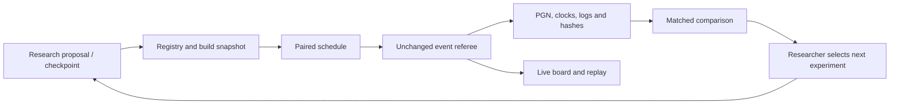

# Chess Lab

A local visual arena and experiment runner for original chess engines. The board watches the
unchanged event referee; it does not implement a second set of chess rules.

## Start

In this workspace, the Python 3.12 virtual environment is already prepared:

```powershell
.venv\Scripts\python.exe -m chesslab serve
```

Open **http://127.0.0.1:8765**. The server listens only on this computer. Click **New experiment**,
then choose a candidate,
opponents, opening split and clock, then start an experiment. Games run sequentially. Select a
game, click moves, use the arrow keys, flip the board, or play its replay. **Follow live** follows
the active game; turning it off lets you inspect a position while the batch continues.

Recent experiments are listed in the sidebar. **Engine registry** shows registered models and
availability. On mobile, the experiment history selector replaces the sidebar. Configuration
opens in a separate panel so the arena stays focused on the board and its results.

The server may already be running. Only one process can write to a results directory. Close it
before starting a headless run with the same directory, or supply a different `--data-dir`.

For a fresh checkout with `uv` installed:

```sh
uv venv --python 3.12
uv pip install -r chesslab/requirements.txt
```

Use `.venv/bin/python` on Linux/macOS and `.venv\Scripts\python.exe` on Windows. This minimal
environment runs the lab and pure Python opponents. It deliberately does not install the large
neural runtime stack. Use the repository's normal `uv sync` environment when developing agents
that import torch, numpy, numba or ONNX Runtime. `requires` in an engine spec lets the UI identify
missing packages before launching that model.

## Running many games at once

**Games at once** in the experiment conditions decides how many games are played side by side.
One at a time is the default and the only setting whose clocks mean what the event's clocks
mean: AGENTS.md gives an agent one core, and a game that shares the machine with five others is
measuring contended time, not its own. Above one, every engine still reads `time_left_ms` and
still manages a clock - just a clock that is now lying to it.

That is a real trade, not a footnote, so the lab makes it visible rather than convenient:

- The run strip says `4 at once`, and the results carry a note saying the games were contended.
- `parallel_games` is written into the run's recorded environment, and `chesslab compare` already
  refuses to compare runs whose environments differ. A parallel run therefore cannot be matched
  against a sequential one, by construction rather than by discipline.
- One game that the lab itself cannot play - a spawn failure, a full disk - is marked `failed`
  and the batch carries on. It stays unplayed, so **Resume** picks it up later.

Use it for what it is good for: coverage across every opening, protocol and reliability sweeps,
and finding the position where a build falls over. Use one at a time for anything you intend to
quote as strength.

**Complete test** in the launch footer sets that up in one press: every ready opponent, every
position in the split, both colours, full games on a fast clock, four at a time. The button
carries the number of games it would schedule before you press it. **Data view** in the run strip
drops the board and the game viewer so the table, the game map and the counters have the width to
themselves, which is what you want while a few hundred games fill in.

While several games are live, a row of chips above the board names each one and switches the
board between them; the game you pick stays the one being followed until it finishes.

## Opening one game, and picking a batch back up

Every square in the **game map** opens that game in its own window: the board at full size, the
clocks the referee recorded, the move list, and the transport controls to step through it a move
at a time or let it replay. Beside the board is what you usually want when a result surprises
you - the opening and its split, how the game ended, which side was the candidate, how much
clock each engine spent and over how many moves, its slowest move and when, the time control
and ply cap, and the game, pair and seed it was recorded under. **Engine output and settings**
holds the UCI identification and whatever the agents printed. **Open in the arena** moves it into
the main viewer if you would rather keep it there.

Opening a game this way does not take the arena over. A batch that is still running keeps
playing, and the arena keeps following the game it is playing, so you can read game 3 while
game 40 is being played.

A batch already moves to the next game by itself. If one is **stopped**, or a restart cuts it
off mid-game, the games it already played keep their results and the run strip offers
**Resume** with the number of games still to play. Resuming replays nothing that finished and
keeps the frozen build the run started with, so the second half of an experiment is the same
code as the first; if that build has been deleted, the lab refuses to resume rather than quietly
playing something else.

## Play the engine yourself

**Play the engine** in the sidebar opens a game against any registered engine. Pick a colour, a
starting position and the clock the engine plays on, then click a piece and the square you want
it on. Legal moves come from the same referee the batches use, so the board offers exactly the
moves the position allows; promotions open a small picker on the promotion square.

Both sides play the clock you pick, and both bars show time remaining. The side to move is
highlighted and its clock ticks down; under ten seconds it turns red. The engine is spoken to
exactly as a batch speaks to it, so a build that mismanages its clock does it here too - and so
do you: run out of time and you lose, or draw if the engine could never have mated you. That is
the referee's own rule for a flag fall.

When a game ends, the result covers the board: **You won**, **You lost** or **Draw**, with the
reason under it and buttons to start another or take the move back. The run strip and the game
panel carry the same verdict, so it is never only in one place.

**Take back** removes your last move and the engine's reply. **Resign**, **New game** and
**Leave** do what they say; leaving stops the engine process and returns the arena to your
experiments. **Save PGN** works mid-game.

Starting positions are the standard start, any of the 32 catalogue positions, or a FEN you paste
in - **Copy FEN** in the viewer and paste it here to sit down in a position a batch game reached.

Sparring never becomes a result. Nothing is written to the experiment record and no game is
scored. A game and a batch also refuse to run at the same time: they would share one core and
neither the game nor the measurement would mean much. Sparring runs the engine from its own
directory rather than a frozen build copy, so it plays the file you just edited.

## What is implemented

- Live board, recorded clocks, legal SAN move list, replay, flip, copy FEN and save PGN.
- Agents added by dropping a folder, file or zip on the page: validated against the platform's
  archive rules, started and asked for a move, then registered. Paths and UCI engines too.
- Human-versus-engine sparring: click-to-move with server-supplied legal moves, promotion
  picker, a real clock on both sides with flag falls scored the referee's way, take back,
  resign, pasted FEN starts, and a result the board tells you about.
- Configurable candidate and opponent pool, immutable Python build copies, registered UCI engines.
- 32 legal public opening positions in eight opening families. Five families are development;
  three different families are validation. The UI spreads small batches across families first.
- Colour-swapped pairs with the same starting FEN and seed, shuffled pair order, and a chosen
  number of games in flight at once, recorded and guarded so contended runs stay uncomparable.
- Persistent experiment history, per-opponent W/D/L, failure counts, complete-pair score and
  conservative uncertainty bounds, plus a game map that opens any game in its own window.
- Stopped or interrupted experiments resume on the frozen build, keeping what already played.
- Export of manifest, per-game JSON with logs and clocks, combined PGN, and raw results CSV.
- Headless JSON experiments and matched comparisons for future tuning/evolution workers.
- Hard UCI watchdog, single-writer results lock, restart interruption tracking, clean process teardown.
- A deadline on the machine description. `platform.platform()`, `machine()`, `processor()` and
  `node()` all go through `platform.uname()`, which asks WMI on Windows; a wedged WMI service
  makes them block with no timeout of their own, and an experiment that never starts is a far
  worse outcome than a thinner environment record. The probe gets four seconds and falls back to
  `sys.platform`, `PROCESSOR_ARCHITECTURE` and `socket.gethostname()`. A run recorded through the
  fallback has a different environment from one recorded normally, so `compare` will not pool
  them - which is the right answer, since you no longer know what the second one ran on.

There are **eight ready pure Python diagnostic opponents across six families**, plus the optional
Numba baseline and any installed UCI engines. These small baselines are useful for regression and
style coverage; beating them does not imply master-level play. Tactical, solid and active are
variants of one original alpha-beta engine. Minimax and its Numba variant share another family.
No trained original neural model is included yet.

In this prepared workspace, **Stockfish 19 is installed and registered**, bringing the ready pool
to nine opponents across seven families. Its official release archive, executable, source and
license are stored under `.chesslab/engines/stockfish19/`. The custom registry and downloaded
engines are local, ignored files; other checkouts must install and register their own references.

## Add opponents and checkpoints

An opponent can be any directory exposing `agent.py` with `get_move(fen, time_left_ms)`, or any
local engine that speaks standard UCI.

The quickest way is to **drop it in**. Drag a folder holding `agent.py`, that file on its own, or
a zip anywhere onto the page; the registry opens with the drop staged, the name filled in from
the folder, and one button left to press. Nothing needs a path typed in, and the browser never
gets one: a dropped file has no path it will share, so the bytes are zipped in the page - the
same shape `make zip` produces - and uploaded.

What arrives is checked before it is kept, and it is the platform's own bar, not a friendlier
one. The archive goes through the same validation as a build pulled from the ladder: `agent.py`
at the root (a single wrapping folder is stripped for you), no paths that escape the directory,
no symlinks, no native binaries or compiled Python even under an innocent name, and the 50 MB
unzipped cap. Then the agent is **started through the platform's runner and asked for one move**
from the opening position. Only a build that answers with a legal move reaches the registry;
anything else is refused with the reason, including the agent's own traceback, and nothing is
left behind on disk.

An accepted build is unpacked into `.chesslab/agents/<id>/` and registered with its third-party
imports as `requires` and its data folders as `includes`, so a later experiment freezes the whole
thing. It shows up in the opponent pool, the candidate list and the play dialog straight away,
and its **Remove** button takes the unpacked files with it.

If the agent is already on this machine and you would rather point at it, or you are registering
an installed UCI engine, **Register a path or a UCI engine instead** at the bottom of the dialog
does that; the lab checks the files exist before saving, so a mistyped path is refused rather
than becoming a dead entry. Either way, entries are written to `.chesslab/engines.json`, the same
file the command line writes.

UCI options, extra build assets and per-move caps still need a JSON spec:

```powershell
.venv\Scripts\python.exe -m chesslab register chesslab\experiments\python-example.json
.venv\Scripts\python.exe -m chesslab register chesslab\experiments\uci-example.json
.venv\Scripts\python.exe -m chesslab catalog
```

Edit the example paths first. Custom specs live in `.chesslab/engines.json`; a matching `id`
overrides a built-in entry. An `id` identifies a particular configuration. `family` identifies
shared engine ancestry or architecture. Keep every Stockfish skill/Elo/time profile in the
**Stockfish** family. An external executable is considered available when found, and its protocol
and options are validated when a game starts. Invalid options produce a recorded init loss.

Python spec:

```json
{
  "id": "a1-0004",
  "name": "A1 checkpoint 4",
  "family": "Original alpha-beta + NN evaluator",
  "kind": "python",
  "path": "checkpoints/a1-0004",
  "includes": ["weights", "config.json"],
  "requires": ["numpy", "onnxruntime"]
}
```

The lab copies Python files, locally imported packages, and declared `includes` using the event
packager's file discovery. It executes that copy throughout the batch. Declare all additional
runtime data in `includes`; files outside the copied build are not part of the frozen identity.
The Python interpreter and installed libraries are shared with the lab. Do not modify that
environment during a run. Hardware, seed and hash recording support reproducibility; wall-clock
search and agents that ignore the seed are not deterministic.

UCI spec:

```json
{
  "id": "stockfish-reference",
  "name": "Stockfish reference",
  "family": "Stockfish",
  "kind": "uci",
  "command": ["C:/engines/stockfish/stockfish.exe"],
  "options": {"Threads": 1, "Hash": 64},
  "assets": [],
  "max_move_ms": null
}
```

Commands are arrays and never run through a shell. The lab supplies both clocks and increments,
preserves game history for repetition, and disables pondering. `max_move_ms: null` lets the engine
manage its clock; a positive value additionally caps each move and defines a restricted profile.
Threads=1 and Hash=64 are set when supported, then explicit options are applied. Record deliberate
hardware/configuration differences when testing GPU engines.

To add neural MCTS opposition, register an installed Lc0 executable with its own supported UCI
options and a local network path; list the network under `assets` so its content is hashed.
Likewise, register independently developed engines such as Berserk or Ethereal, your own MCTS
agent, static neural policies and earlier original checkpoints. Executables and listed assets
are hashed at start and rechecked at the end; a changed external artifact invalidates the batch.
List external scripts, separate evaluation networks and book files in `assets` too. No external
engines or networks are silently downloaded by this application.

Third-party engines and networks are **offline research opponents only**. The lab is not imported
by the root `agent.py`, and normal submission packaging excludes the entire lab and results tree.
The submission rules still apply to the agent you upload; see the [live event docs](https://aichessathon.com/docs).

## Share agents with other people

`ladder/` is a small Cloudflare Worker holding a shared catalogue of agent builds. People drop a
`submission.zip` (or the folder around their `agent.py`) on the site; everyone else pulls it down
and plays it locally. The Worker stores and validates builds and never runs one, so games stay on
the harness here.

```powershell
.venv\Scripts\python.exe -m chesslab ladder pull --url https://your-ladder.example.com
.venv\Scripts\python.exe -m chesslab ladder push submission.zip --name "A0 checkpoint 4"
.venv\Scripts\python.exe -m chesslab ladder list
```

`pull` verifies each download against the hash the catalogue recorded, revalidates the zip before
unpacking it, writes it to `.chesslab/uploads/<id>/`, and registers it. Uploads then appear as
opponents beside the built-in baselines, with `includes` and `requires` derived from what the zip
actually contains. It rewrites only the entries it owns, so hand-registered engines survive. The
address and token are remembered in `.chesslab/ladder.json`. Withdrawing an agent on the site
removes the local copy on the next pull.

Both ends refuse a zip with no root `agent.py`, a path that escapes the agent directory, a
symlink, a `.pyc`, anything over the 50 MB unzipped cap, or a native binary — detected by magic
number as well as by extension, so renaming `engine.so` to `weights.onnx` does not get through.

Validation is not isolation. An uploaded agent is code that runs on this machine when you play
it, under your user; the note above about trusted local code applies with more force once other
people can add to the registry. `ladder/README.md` covers deployment, locking the site behind
Cloudflare Access, and the container flags that fix this.

## Headless runs and comparison

```powershell
.venv\Scripts\python.exe -m chesslab --data-dir .chesslab\headless run chesslab\experiments\smoke.json
.venv\Scripts\python.exe -m chesslab --data-dir .chesslab\headless run chesslab\experiments\development.json
.venv\Scripts\python.exe -m chesslab compare .chesslab\runs\BASELINE_ID\manifest.json .chesslab\runs\CANDIDATE_ID\manifest.json
```

The smoke preset has 16 shortened games. It checks reliability. The development preset schedules
160 full-length games against eight opponents. The UI offers the event clock as well as faster
development clocks. `ply_cap` has the **same absolute ply interpretation as the event referee**;
it includes the opening's fullmove number, not just moves played after loading the FEN.

Comparison matches only complete pairs sharing the opponent build hash, opening FEN and seed. It
rejects different clocks, caps, splits, recorded environments or evaluator code. It reports a
separate score change per opponent; it does not mix opponents into a misleading universal Elo.
Stopped batches may contain an unmatched game: this remains in W/D/L, but cannot enter a pair
score or comparison. Failed/interrupted experiments cannot be compared.

## Records and interpretation

```
.chesslab/
  engines.json                       custom opponent registry
  runs/<run-id>/manifest.json         schedule, configs, hashes, status, results
  runs/<run-id>/builds/<engine-id>/    frozen Python code and declared assets
  runs/<run-id>/games/g00001.json     frames, clocks, engine identity and logs
  runs/<run-id>/games/g00001.pgn      authoritative referee PGN
```

The displayed score is the average candidate score over **complete colour pairs**: a win is 1,
a draw is 0.5, a loss is 0. UI W/D/L totals include all completed non-void games, including an
unmatched final game. A failure count records candidate losses due to flags, crashes, illegal
moves or init failures. A game-map `!` can also indicate that the opponent failed. Void games
are counted separately and never scored. Final clock frames are reconstructed from referee PGN
annotations; live clock observations are approximate. Failed move attempts are not legal PGN moves.

The 95% bounds use Hoeffding's inequality on bounded independent pair scores, and are intentionally
wide for small samples. Public opening positions are correlated and not a random sample of all
chess: these are **exploratory bounds**, not a final significance test or proof of improvement.
Repeated deterministic games do not create independent evidence. Comparison bounds also require
independent matched opening pairs. Repeatedly checking these intervals is not a valid sequential
promotion rule. There is no automatic candidate promotion.

The lab preserves the repository's referee, clocks, legality and process protocol. It does not
reproduce the organiser's hardware, CPU affinity, RAM limit, read-only filesystem or network
isolation. Native Windows also cannot reproduce the harness's Unix process suspension. The
browser and server consume some local CPU, so final strength confirmation should use headless
runs on an otherwise idle Linux environment matched to the competition. Agents are trusted local
code: this is not a sandbox for untrusted executable uploads.

## Research loop to build on this foundation

1. Establish an original classical candidate and a fixed reference checkpoint. Keep a saved JSON
   experiment protocol with full clocks/caps and pinned opponent versions.
2. Use the development pool for cheap screening: legality/failures first, then full-game score by
   opponent and opening family. Export losses for tactical-error analysis and training examples.
3. Add independently trained neural, MCTS and hybrid candidates through the same Python adapter.
   Expand external opposition with different engine families, not only weaker Stockfish settings.
4. A tuning worker proposes a configuration, writes a checkpoint, registers it, and launches a
   headless JSON batch. Store proposal, parent checkpoint and training-data provenance beside the
   run. Use SPSA for small numeric parameter sets and bounded architecture search for major choices.
5. Match candidate results against the reference using the comparison command. Spend longer games
   only on survivors. Separate evaluation budget from training budget and retain all failed proposals.
6. Confirm finalists on the separate validation families, then a newly frozen, genuinely unseen
   final opening set. Implement a preregistered paired testing or SPRT protocol before automating
   promotion. Keep final-set access and evaluator editing outside any proposal-generating agent.

Training, genetic search, automated promotion, position labelling, rating estimation and remote
workers are intentionally future modules. The current system provides their callable evaluator
and durable evidence. The longer-term design is in `docs/research/stockfish-research-plan.md`.



## Verify

```powershell
.venv\Scripts\ruff.exe check .
.venv\Scripts\mypy.exe
.venv\Scripts\python.exe -m unittest discover -s chesslab/tests -v
.venv\Scripts\python.exe -m harness.arena --opponent baselines/random --games 2 --base-ms 5000
.venv\Scripts\python.exe -m harness.package
```

Ruff and mypy are development dependencies (`uv pip install ruff mypy`). Mypy uses the target
Linux platform because the unchanged event harness references Unix signal APIs. The Windows
lab lock is exercised by integration tests on Windows. Optional browser checks use Playwright
and a local Edge install; they exercise a real running server rather than mocked moves.
