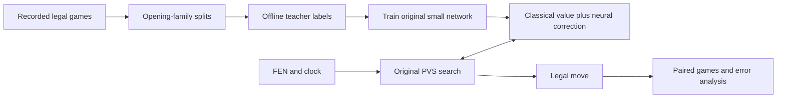

# Small network + search: first implemented experiment

11 September 2026. **Decision: keep the hybrid experimental.** The architecture is working,
but the first network does not pass its independent test-family prediction gate. No claim of
an Elo gain or of beating Stockfish follows from this pilot.

## What was reviewed and changed

The new A1 0.2.0 work added transposition score bounds, null-move pruning, late-move reductions,
and Stockfish node/Elo ladders. These are useful controls for research. Version 0.2.1 retains
them with two fixes; **0.2.2** adds the measured compiler-startup change below:

- Score-cache hits compare all six packed position words. The former folding hash was suitable
  for move hints but could not establish that a cached score belonged to the same board.
- Simulated passes are isolated from real-history draw claims and score-cache reads/writes.
  Nested passes are disabled, and null pruning is limited to non-mate null windows. A regression
  constructs a legal king triangulation whose subsequent pass otherwise fabricates threefold.

The former stop-restoration test also allocated only six control slots after the search had
grown to eight. It now uses the named control size (nine with the synthetic-history flag).
Numba does not bounds-check these arrays by default, so this mattered to test reliability.

Selective search remains approximate. Piece zugzwangs still exist; a shallow reduced search
can miss a strong quiet move; relaxed transposition reuse still has graph-history interaction.
Passing a few tactical positions does not prove these heuristics safe in every position.
Frozen A1 0.1.0 and 0.2.0 builds were preserved. The root submission still uses A0.

## The implemented hybrid



`a1/neural.py` implements 768 piece-square inputs, a 32-unit clipped-ReLU layer and one output.
Piece colours and ranks are transformed to the side-to-move's perspective. Colour-swapped,
rank-mirrored boards therefore produce the same relative score without data augmentation.
The output corrects the classical evaluator by at most 600 cp, with a final bound below mate
scores. Search alone supplies terminal mate scores.

`Search(evaluator=...)` calls the compiled evaluator at leaves. The same board representation,
search parameters, clock policy and legal-move checks serve both variants. Blend zero returns
the original evaluator exactly. Each search owns its score table; do not swap weights into an
existing search with old cached scores.

This first network refreshes sparse features at every leaf. It is **not yet incrementally
updated NNUE**. It also has no explicit policy head, castling/EP features, recurrent plan state,
or learned uncertainty. The network supplies positional values; search examines how moves
change those values. Learned long-term strategy is a hypothesis to test, not a separate
capability established by this small architecture.

The combination itself is established: Stockfish already uses efficient neural evaluation
with search. Sparse features and incremental updates explain why small CPU networks fit this
role. Our code and weights are original; this is not a port of Stockfish or its network.
[Stockfish's NNUE explanation](https://official-stockfish.github.io/docs/nnue-pytorch-wiki/docs/nnue.html)

## Data, training and results

The labeler reads the user's 70-game export plus the two completed 44-game A1 runs as data.
It reconstructs legal histories, skips terminal and checked positions and sparsely samples
positions with at least eight pieces. It never executes engine paths from those exports.
An explicitly selected local Stockfish 19 binary provides fresh-game, one-thread, 10,000-node
labels. Its identity, binary hash, options, actual search information and source-game hashes
are recorded. These are finite-search estimates, not true chess values.

The 893 sampled positions were divided **before training**:

| Split | Whole opening families | Labelled | Non-mate cp labels used |
|---|---|---:|---:|
| Train | Open games, Sicilian, French | 593 | 525 |
| Validation | Queen's gambit | 150 | 131 |
| Test | Flank openings | 150 | 138 |

Equivalent network inputs, including colour mirrors, are deduplicated across all splits.
Mate-distance labels are retained in the dataset but excluded from this regression model.
No adjacent positions from the same game enter different splits. These are public development
families; the lab's other validation families were not used. The test family is now observed
research data and must not become a repeatedly tuned final benchmark.

Training starts from seeded random weights and uses an original NumPy Adam implementation.
The target is `tanh(teacher_cp / 400)`, with MSE on the corresponding predicted value.
This is a bounded score transform, **not calibrated win probability**. Of 100 epochs, epoch 10
was selected using validation loss only; the test family did not select the epoch.

| Split | Classical MSE | Hybrid MSE | Relative change |
|---|---:|---:|---:|
| Train | 0.16386 | 0.06171 | −62.3% |
| Validation | 0.15331 | 0.12864 | −16.1% |
| Test | 0.18637 | 0.20178 | **+8.3% worse** |

Test mean absolute cp error moved from 288.6 to 285.6, slightly better. The two metrics disagree;
we retain the predeclared training-loss result rather than choosing the favourable statistic.
The test regression demonstrates limited generalisation in this pilot. It does not prove which
factor caused it: sample size, family shift, teacher noise and model design are all candidates.
The effective independent sample is much smaller than the position count because games and
opening families are clustered.

In a 12-position timing screen, median neural leaf cost was **1.59×** classical. The median
equal-500-ms search node ratio was about **1.00×**, but different leaf scores change explored
trees, so that ratio is not an inference-throughput or strength gain. This local host was not
reserved or affinity-controlled. The benchmark's 138-second warm-up compiled both evaluator
variants and timing kernels; that is not the agent's import time.

The separate hybrid entrypoint compiles only its selected evaluator. The initial 0.2.1 archive
passed the unchanged runner's 90-second startup limit in **83.4 seconds**, then returned legal,
on-time replies for all 20 short-clock trials. That archive is **289,317 bytes uncompressed**.
However, both agents then exceeded 90 seconds during the first paired run. Its one completed
game is void; the run was interrupted and retained, not counted as chess-strength evidence.
[Interrupted-run audit](results/hybrid-pilot-interrupted-audit.json)

Two fresh-process compiler ablations also passed the 20 replies: restricted reference-count
pruning took **74.7 s**, and LLVM optimisation level 1 took **61.8 s**. These are individual local
measurements with differing host load, not an isolated causal speed-up estimate. Version 0.2.2
defaults to level 1 before importing Numba; it retains normal reference-count pruning. The
configuration is public and documented by Numba. Runtime cost must also be measured before
promotion. [Numba compilation options](https://numba.readthedocs.io/en/stable/reference/envvars.html#compilation-options)

These trials reuse four previous failure FENs at 108/124 ms; they do not reproduce
the former direct test's forced 95-ms increment estimate. Full games test clock progression.

The replacement diagnostic uses one full colour-swapped pair from English at 5 s + 50 ms,
against identical classical search and the same compiler policy. The smaller run is a pipeline
check because the model already failed its predictive gate. The old four-game configuration
remains in its frozen manifest. Neither test is large enough for a promotion decision.

## Reproduce and inspect

Use `.venv/Scripts/python.exe` for `python` in Windows PowerShell.

```text
python -m chesslab.experiments.label_neural <run-directory> <another-run> --engine <local-stockfish-executable> --out <new-dataset-directory> --nodes 10000
python -m chesslab.experiments.train_neural <dataset-directory>/dataset.json --out <new-model-directory> --hidden 32 --epochs 100
python -m chesslab.experiments.bench_neural --model <model-directory>/model.npz --dataset <dataset-directory>/dataset.json --out <new-report.json> --ms 500
python -m chesslab.experiments.build_a1 --out <new-checkpoint> --model <model-directory>/model.npz
python -m chesslab.experiments.verify_checkpoint <checkpoint> --out <new-verification-directory>
python -m chesslab run chesslab/experiments/hybrid-pilot-pairs.json
```

Chess Lab entries are **A1 0.2.2 classical control** and **A1 neural pilot · experimental**.
The diversity configuration adds the solid, active and rollout diagnostic families plus
Stockfish. Multiple Stockfish settings remain one engine family, not independent opponents.
The larger diversity screen is configured, not evidence already measured for this hybrid.

Local evidence lives in `.chesslab/studies/hybrid-pilot-*`. Portable reports:
[training](results/hybrid-pilot-training.json),
[timing](results/hybrid-pilot-benchmark.json),
[extracted-package verification](results/hybrid-pilot-package.json).
Training source snapshots and progress records are retained locally. Only source, weights and
training provenance enter the candidate archive; teacher binaries and position-label tables do not.

## What to do next

1. **Finish the deployment and search controls.** Reduce cold JIT time with measured compiler/
   kernel changes, then repeat fresh-process startup, low-clock and extracted-archive games.
   Benchmark 0.2.1 against the frozen 0.2.0 to quantify the cost of the correctness fixes.
2. **Improve data coverage before growing the network.** Generate balanced games across more
   engines, openings, material phases and advantage ranges. Preserve whole-game/opening splits.
   Compare shallow labels with deeper reanalysis on a prespecified sample; sample difficult
   disagreements without turning the entire corpus into unusual tactical failures.
3. **Run a small controlled architecture study.** Start with 16/32/64 hidden units, residual
   versus direct evaluation, and sparse refresh versus incremental accumulation. Keep search
   fixed. Incremental updates need independent checks for captures, EP, castling, promotions,
   make/unmake, null moves and aborted search. Measure integer quantisation error before games.
4. **Choose by a sequence of gates.** Require legal/reliable operation and adequate init margin,
   then held-out predictive improvement, then acceptable equal-time search cost. Use paired
   games against the frozen control and diverse opponents; analyse at the opening-pair level.
   A full-strength Stockfish result must name both budgets, version, hardware and sample size.
5. **Automate research selection outside the move loop.** Start with a small grid and successive
   halving. Use evolutionary search only after stable gates exist: genomes can encode width,
   feature sets, loss mixing and search thresholds. Keep validation families for selection,
   penalise latency/startup/failures, preserve diverse survivors, and evaluate the locked winner
   once on fresh held-out families. Optimising benchmark scores repeatedly is overfitting.

The useful agentic layer proposes experiments, validates provenance, schedules games and
summarises failures. The playing process stays a deterministic budgeted search plus trained
evaluator. An LLM debating every move would need a separate measured benefit to justify its
cost; it is not required for positional learning or self-improvement.

The live rules allow models trained by the team, including engine-labelled training data, while
prohibiting shipped third-party engines and pretrained chess networks. The canonical Markdown
URLs failed to open during this review; the live docs were checked on 11 September.
[AI Chessathon documentation](https://aichessathon.com/docs)
