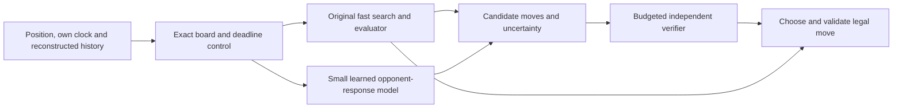

# Finding exploitable chess decisions

Research update · 10 September 2026

**Recommendation: build a stronger original engine, then add a small opponent-aware controller
and an independent verifier.** The useful target is a position that is difficult for the opponent
but relatively cheap for our system to solve. Merely making positions complicated will usually
help the much faster engine. An apparent weakness must survive increased search, be reachable
against normal opponent responses, and improve complete-game results at the declared clock.

The new [position study](stockfish-budget-probe-results.md) supplies a working discovery tool and
an instructive negative result. Across 24 positions from six supplied games, Stockfish 19 changed
its preferred move in 15 as its node budget changed. The most dramatic low-budget error disappeared
at the next budget, and Stockfish played the correct move in the recorded game. No full-strength
exploit has been demonstrated. The existing [research programme](stockfish-research-plan.md)
remains the broader architecture and evaluation reference; this document prioritises the next
experiments using the measured evidence.

## What the evidence supports

Stockfish is a selective search engine with safeguards, not an exhaustive solver of ordinary
middlegames. Its release source includes null-move conditions and verification, reduced searches
with re-searches, and selective pruning. These mechanisms suggest searching for rare lines whose
importance is underestimated; their existence does not establish a bug. In particular, “use
zugzwang against null-move pruning” overlooks protections already in the implementation.
Its time allocation also responds to evaluation changes and move instability, so inducing many
legal moves is not by itself a clock exploit. [Stockfish 19 search source](https://raw.githubusercontent.com/official-stockfish/Stockfish/sf_19/src/search.cpp),
[time management source](https://raw.githubusercontent.com/official-stockfish/Stockfish/sf_19/src/timeman.cpp)

Its neural evaluation and rule-aware adjustments also make “it only counts material” an unsuitable
starting assumption. A prospective blind spot must be measured on the pinned executable; source
inspection explains a hypothesis but does not validate it. [Stockfish 19 evaluation source](https://raw.githubusercontent.com/official-stockfish/Stockfish/sf_19/src/evaluate.cpp)

Three research leads deserve careful separation:

| Evidence | Useful idea | Limit on the conclusion |
|---|---|---|
| Adversarial policies against superhuman Go systems | Learn a strategy that induces an opponent's systematic errors | A result in Go does not establish the existence of an equivalent chess strategy |
| Adversarial endgame discovery | Use exact endgame outcomes to search for budget-dependent errors | A constructed position need not be forceable; an error may disappear with more search |
| Opponent-model rollout for chess | Evaluate our moves using likely opponent responses | Additional searches and favourable opponent assumptions can account for apparent gains |

The Go work is direct evidence that legal-play exploitation can succeed in another game.
[Adversarial Policies Beat Superhuman Go AIs](https://arxiv.org/abs/2211.00241)
The retrieved abstract for *Discovery of Adversarial Endgame Chess Positions* describes
tablebase-guided discovery and limited transfer across Stockfish compute budgets. The full paper
and publication status could not be verified here; treat it as a provisional lead, not a
replicated Stockfish 19 result. [AdvChess manuscript record](https://openreview.net/pdf?id=nIYtXmeY3F)

The MPC chess paper is particularly relevant, but its reported experiment gives the opponent
the compute used to evaluate **one** root candidate, rather than the meta-engine's entire move.
Its deterministic variant also uses the nominal opponent's predicted reply as the actual reply;
the stochastic variant relaxes that assumption. This motivates a controlled rollout experiment,
not a claim that wrapping an engine yields a fair one-core victory. Reproduce the idea with
original components and charge every candidate evaluation to the same total clock.
[Superior Computer Chess with Model Predictive Control, Reinforcement Learning, and Rollout](https://arxiv.org/html/2409.06477v1)

## Six experiments worth pursuing

The following are proposed mechanisms, not established Stockfish weaknesses.

| Priority | Hypothesis and implementation | Decisive experiment | Reject or revise when |
|---|---|---|---|
| 1 | **Asymmetric search difficulty.** Mine legal trajectories where a compact specialist can verify an important continuation that the target discovers late. Start with quiet moves, delayed threats and forcing defensive sequences. | Compare specialist on/off at equal total wall time; test ordinary target replies, larger budgets and retained game state. | The gain disappears with modest extra target search, or our engine spends more finding the position than it gains. |
| 1 | **Opponent-response modelling.** Train a small policy from scratch to predict replies across opponent families and budgets. Use it to allocate search among otherwise sound candidate moves. | Compare against a generic policy and the same controller without opponent conditioning. Include unfamiliar engines and mistaken identity assumptions. | Prediction improves but complete-game score does not, or model errors cause larger losses than exploitation gains. |
| 1 | **Selective independent verification.** Use disagreement, unstable scores and position features to choose when to broaden search or check a neglected move. | Compare learned routing with fixed extra search and randomly allocated verification at equal cost. | A simpler allocation produces the same gain, or the verifier shares the primary evaluator's error. |
| 2 | **Plan representations.** Test compact features for pawn barriers, king access, promotion routes and exchanges that change those structures. | Closed-position and fortress/zugzwang suites with diverse critics, then games from earlier positions. | Better suite scores fail to transfer, or features routinely misclassify tactical exceptions. |
| 2 | **Proof-directed endgames and conversion.** Use small tablebases or bounded forcing-line proofs to turn narrow advantages into outcomes. | Score exact draw-aware endgames, conversion games and a tablebase-enabled opponent control. | The advantage exists only because the reference was denied an available oracle, or a proof misses a legal defence. |
| 2 | **Value of additional computation.** Learn whether another search tranche is likely to change a consequential decision. | Replace the existing allocator while holding the engine and whole-game clock fixed. | Saved time is spent on irrelevant instability, or clock failures and conversion failures increase. |

The first experiment should distinguish tactical traps from strategic traps. A tactical trap asks
the opponent to miss a short refutation, which more search may quickly cure. A strategic trap asks
it to repeatedly prefer a harmful class of plans. The latter could generalise better, but requires
much stronger evidence: several independently reached instances, alternative defences, and
conversion from ordinary starting positions.

Exact endgame labels require the appropriate draw semantics. Syzygy distinguishes ordinary wins
from cursed wins and blessed losses, and DTZ interpretation depends on the fifty-move situation.
Do not label arbitrary FENs by piece count and WDL alone. Preserve halfmove counters and game
history, and make the tablebase policy part of each benchmark. [python-chess Syzygy documentation](https://python-chess.readthedocs.io/en/latest/syzygy.html)

## Architecture to test

The core engine must remain useful when the opponent model is wrong. A controller can rank moves
by predicted expected score against a distribution of replies, while limiting how far their
conservative **estimated** values fall below the baseline move. Formally, with all values from
our perspective:

    choose a to maximise Σ_b q(b | position, a, history) × estimated_score(after a, b)
    among moves passing a separately calibrated downside and uncertainty check

The reply distribution is conditioned on our candidate move as well as the current position.
Evaluate plausible alternative replies, rather than substituting one predicted move for all
opponent choices. Fall back toward the baseline as model uncertainty or disagreement increases.
Because neither the baseline nor the critic is an exact minimax oracle, this is an approximate
risk control, not a guarantee that the selected move cannot worsen the position.
Game-theoretic work on safe exploitation motivates the tradeoff; its guarantees do not transfer
automatically to heuristic chess scores. [Safe Opponent Exploitation](https://www.cs.cmu.edu/~sandholm/www/safeExploitation.teac15.pdf)

The event interface supplies FEN and our remaining time, not the opponent's identity or clock.
State persists within a game and execution is suspended during the opponent's turn. The deployed
controller must therefore infer a distribution over opponent behaviours from observed moves;
it cannot use the lab's opponent ID, private clock fields or background search. Ship original
Python and independently trained weights. The current documentation permits book lookup through
move number 20 and endgame lookup with at most seven pieces, within the total 50 MB limit;
middlegame answer tables are prohibited. [Competition documentation](https://aichessathon.com/docs)

For the constrained track, start with cheap numeric inference and incremental features. A runtime
language-model committee is a low-priority experiment because its overhead must displace actual
search. For the longer-term accelerator track, maintain an independent policy/value tree-search
branch. Lc0 provides a useful external opponent family for this comparison; its architecture is
different from the existing alpha-beta diagnostics. Pin its executable, network and backend, and
report GPU resources separately. [Lc0 development overview](https://lczero.org/dev/overview/)

The response predictor and outcome critic have different jobs. A predictor should reproduce
the target's choices, including mistakes. A critic should recognise when those choices are bad.
Training both solely to imitate the same shallow target risks reproducing the very error we want
to detect. Compare deeper labels, independent engine labels, draw-aware tablebases and original
self-play, retaining the provenance and uncertainty of each label.

## Turn discovery into a reliable improvement loop

**Generate trajectories, not just interesting diagrams.** Start from development openings and
mutate our legal move choices. Let the target choose its own replies. Maintain a separate pool
of constructed positions for mechanism discovery, clearly distinguished from reachable game
strategies. A legal path from an opening proves existence of a path, not that the opponent will
cooperate in following it.

Archive candidates across descriptors such as pawn structure, material, king exposure, quiet-move
content, tactical horizon and observed search instability. MAP-Elites supplies a general method
for retaining diverse high-quality candidates instead of collapsing onto one discovery pattern.
Its use here is an experimental design choice, not evidence of chess strength.
[Illuminating search spaces by mapping elites](https://arxiv.org/abs/1504.04909)

Use measured outcome uplift from an earlier game position as the eventual fitness. Before full
games are affordable, maintain separate proxy columns: estimated error magnitude, probability
of reaching the position, conversion rate, our own downside and compute cost. A product such as
“reach × error × conversion” can guide screening, but should not hide a near-zero reach rate or
an unreliable critic. Keep stable positions and failed hypotheses in the archive too.

**Search architectures in bounded spaces.** Begin with a small genome: board backend, evaluator
size, move-ordering policy, verification threshold, opponent-model weight and budget allocation.
Apply compatibility and memory checks before expensive games. For each research batch compare:

1. The unchanged reference and a simple random search over the same configuration space.
2. SPSA or another numeric optimiser for a fixed architecture's continuous parameters.
3. Mutation/crossover over compatible discrete architecture choices, preserving several survivors.
4. Offline coding-agent proposals for changes outside the numeric genome.

This avoids crediting an elaborate evolutionary system for gains obtainable by cheap tuning.
Charge inference, failed builds, training, label generation and evaluation to the total research
budget. AlphaEvolve demonstrates the broader propose-program/evaluate/select pattern in other
domains; chess improvement remains something this lab must measure.
[AlphaEvolve technical report](https://arxiv.org/abs/2506.13131)

**Protect evaluation from the improvement loop.** Split by complete game and opening family,
not randomly among adjacent FENs. A proposal generator may inspect development failures but
must not edit its judge or see the final holdout. Promote frozen artifacts only. Log every
proposal, parent, data hash, failure and rejected experiment so that repeated selection does
not disappear from the record.

Use colour-swapped opening pairs. Report average score, worst opponent-family score, clock and
legality failures, and pair-level uncertainty. For a response model add held-out log loss or
Brier score and calibration; for a verifier add consequential-error detection and false-alarm
cost. Keep exact outcome errors separate from finite-search evaluation disagreements. Engine
WDL output is a model estimate, not a tablebase result or a calibrated prediction of our match.

Choose the confirmation protocol before running it. A variance pilot can determine the sample
needed for a meaningful minimum effect; reserve different openings for confirmation. Either use
a predeclared fixed sample or implement an appropriate paired sequential test. Repeatedly reading
an ordinary 95% interval until it looks favourable is not a valid promotion rule. Stockfish's
testing documentation describes paired outcome statistics and sequential testing that can inform
the implementation. [Fishtest mathematics](https://official-stockfish.github.io/docs/fishtest-wiki/Fishtest-Mathematics.html)

## Ordered implementation milestones

| Milestone | Deliverable and control | Exit condition |
|---|---|---|
| M0 — delivered | History-preserving position probe, pinned Stockfish queries, A0 profiles and raw evidence | Completed 24-position study; source, engine and position hashes retained |
| M1 — next | Original compiled board/search experiment, using the existing evaluator initially | Differential legal-move/perft and undo tests against python-chess; special-move, draw/history and deadline checks; uninstrumented speed comparison; paired games against frozen 0.1.2 |
| M2 | Diverse opponent and position curriculum | Add a pinned independent alpha-beta engine and a neural-search engine; separate cold/warm-state and clock tests; no family represented solely by weakened Stockfish |
| M3 | Adversarial trajectory miner and error verifier | Surviving errors at target clock and increased compute; separate exact labels, estimated labels and reachable full-game outcomes |
| M4 | Original response model plus optional verifier/controller | Better held-out results than both the base engine and an equal-cost generic extra-search control; acceptable downside on other families |
| M5 | Bounded tuning/evolution executor and protected confirmation | Improvement per research cost beats simpler search; independent confirmation and replication on frozen opponents/openings |

The board/search experiment comes first because the new profile attributes about 58% of
instrumented A0 self time to python-chess routines. This does not predict a particular speedup;
it identifies a substantial area to measure. Keep python-chess as the independent correctness
reference while implementing original array/bitboard operations and search loops. Use the
existing hand evaluator first so backend speed and neural quality are not changed simultaneously.

For M2, the public [Ethereal repository](https://github.com/AndyGrant/Ethereal) and
[Berserk repository](https://github.com/jhonnold/berserk) are candidate independent engine projects
to assess for available builds and licence terms. Add one with a pinned executable and declared
assets; they are proposed opponents, not installed capabilities. A separate Lc0 reference gives
more architectural diversity than adding many alpha-beta variants. Include original A0 checkpoints
and weak diagnostics for regression detection, but do not use wins against them as evidence of
Stockfish-level strength.

Success means positive expected score against a specified Stockfish configuration under a
declared resource budget and unseen starting distribution, followed by replication. “Defeats all
bots” cannot be established by any finite opponent pool. The broader research objective is an
advantage that transfers across versions, budgets and engine families, with explicit records of
where it fails.
