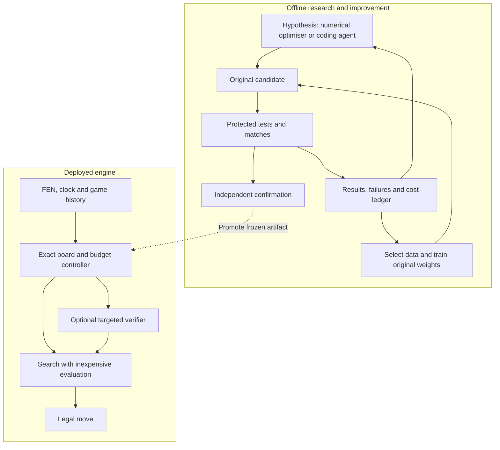

# Research Programme for an Original Chess Engine

**Implementation update, 10 September 2026:** the lab now includes a completed
[24-position Stockfish budget study](stockfish-budget-probe-results.md). The
[exploitation roadmap](stockfish-exploitation-roadmap.md) prioritises original compiled search,
opponent-response modelling and independent verification using that evidence. It distinguishes
budget-sensitive decisions from demonstrated full-game exploits.

**Recommendation.** Build an original, fast search engine and an automated research system that improves it through controlled experiments. For a single CPU core, the leading initial candidate is alpha-beta search with an inexpensive incremental neural evaluator. A learned move-ordering model and a controller that allocates extra search are the first architectural extensions to test. Maintain a separate policy/value tree-search branch for accelerator deployment. Use genetic and evolutionary methods to search bounded design choices, and use coding agents to propose testable algorithm changes.

This is an evidence-based starting hypothesis, not a finding that this architecture will defeat Stockfish. The programme should be capable of rejecting that hypothesis. Its central asset is a trustworthy, economical experiment loop: stronger claims and more elaborate optimisation are justified only as that loop produces evidence.

**1. Define the result before choosing the architecture.** The primary long-term objective is a positive expected match score against a pinned, full-strength Stockfish configuration on a predeclared distribution of unseen openings. A credible success claim requires an uncertainty interval excluding equality, followed by an independent replication. A single win, a favourable starting position, or beating a strength-limited configuration establishes a narrower result.

The official download page currently identifies Stockfish 19. Use that release as the initial fixed reference, record its binary and network hashes, and periodically add newer releases as separate robustness targets. The competition's house-engine version and settings are not established by the public information used here. [3: Download Stockfish 19](https://stockfishchess.org/download/)

Define three evaluation tracks so hardware advantages do not become confused with algorithmic improvements:

| Track | Question | Required comparison |
|---|---|---|
| Constrained deployment | Can original code outperform the reference within the event-like resource envelope? | Equal CPU allocation, complete clocks, memory, pondering and tablebase policies; report language/runtime constraints |
| General engine research | Can a GPU or larger model outperform Stockfish under a stated resource allocation? | Publish both machines, wall time, resource usage and separate cost/energy comparisons where measured |
| Targeted exploitation | Can a specialist induce a pinned opponent's errors in real games? | Unseen starting positions, opponent responses chosen normally, target-budget and version-transfer tests |

Equal nodes are useful for diagnosing one search implementation. They are not a fair strength comparison across alpha-beta, MCTS, neural networks and language models: their nodes have different costs and meanings. Similarly, equal nominal depth does not imply equal work or equal coverage.

The current competition contract specifies Python source, one CPU core, 2 GB memory, a 50 MB unzipped submission, no GPU/network, a 90-second import budget, and 120 seconds plus 0.5 seconds per move. The interface supplies a FEN and the agent's own clock. State persists within a game. Third-party engines and pretrained chess networks cannot ship; models trained from scratch on engine-labelled positions and shipped books/tablebases are permitted. These constraints define the constrained track; the longer research horizon does not automatically remove them. [1: Competition documentation](https://aichessathon.com/docs) The versioned framework governs competition conduct and precedence. [2: Rules and code of conduct](https://aichessathon.com/terms)

A useful mathematical objective is:

    maximise E[game score against pinned Stockfish]
    subject to legality, reliability, latency, memory, artifact size and originality

The expectation is over the declared openings, colours and any stochastic seeds. Secondary objectives are performance against a diverse opponent pool and improvement per unit of research compute. Do not hide weak direct results behind a composite score whose weights can be changed after seeing outcomes.

**2. Separate three meanings of “agentic”.** Every chess-playing program is an agent in the broad decision-theoretic sense. Here, “agentic research” means a system that proposes changes, executes experiments, analyses failures and decides the next experiment. “Agentic play” means a move-selection system that dynamically delegates computation among specialist components. A language-model committee is only one possible implementation of the latter.

| Design | Plausible benefit | Cost or failure mode | Research position |
|---|---|---|---|
| Conventional search with fixed control rules | Low overhead; reproducible; clear baseline | Hand-tuned allocation may waste effort | Essential control |
| Search with a small learned controller | Chooses when to deepen, verify, invoke a policy or stop | Controller overhead and misleading uncertainty | High-priority experiment after baseline |
| Several chess specialists with a budget manager | Different search/evaluation errors may complement each other | Duplicated work, incompatible scores, routing mistakes | Conditional research branch |
| LLM debate during each move | Flexible hypothesis generation and verbal explanations | Expensive inference; correlated errors; reasoning may not track the board | Low-priority constrained-track candidate |
| LLM-guided offline engine development | Can propose code, features and experiments beyond a fixed numeric search space | Optimises a flawed evaluator if the experiment system is weak | Strong candidate, measured against simpler automation |
| Numerical optimisation without LLMs | Cheap and reproducible parameter search | Cannot invent changes outside its parameterisation | Mandatory comparison for the agentic research system |

AlphaEvolve demonstrates a useful general pattern: language models propose programs, automatic evaluators score them, and an evolutionary archive guides further proposals. Its reported results concern algorithmic and computing problems; they do not demonstrate chess superiority. The transferable idea is the propose–verify–select loop. [11: AlphaEvolve: A Gemini-powered coding agent for designing advanced algorithms](https://deepmind.google/blog/alphaevolve-a-gemini-powered-coding-agent-for-designing-advanced-algorithms/)

Recent chess post-training work studied Qwen2.5 and Llama3.1 variants and found substantial limitations despite improvements from dense expert guidance. This supports caution about the tested form of verbal reasoning. It does not prove that every future language model or tool-assisted system must fail at chess. [9: Can Large Language Models Develop Strategic Reasoning? Post-training Insights from Learning Chess](https://arxiv.org/html/2507.00726v3)

Test the value of research agents directly. Give four development methods the same initial engine, editable components and total budget: random/configuration search; numerical optimisation; a single coding agent; and a structured proposer/reviewer system. Count inference, failed builds, human intervention and tournament compute. Compare the best independently validated engine produced, and the full improvement-versus-cost trajectory. More generated ideas or longer discussions are not success metrics.

Proposed separation of research and play:

**3. Interpret the research evidence at the correct scope.** The following findings motivate experiments; their limits prevent inappropriate claims.

| Evidence | Supported conclusion | What it does not establish |
|---|---|---|
| Stockfish search and NNUE engineering | Fast incremental evaluation and selective search are deeply integrated | A shallow copy of the high-level design will match its strength |
| AlphaZero's historical chess matches | Learned policy/value search can outperform a strong Stockfish version | A small project can reproduce this against Stockfish 19 on one core |
| Searchless chess transformers | Large-scale distillation can produce strong chess decisions without explicit tree search | Human-pool Elo is interchangeable with engine Elo, or the largest model fits the constrained artifact |
| Gumbel AlphaZero | Root action selection and training targets can improve learning under small simulation budgets | Superiority over modern alpha-beta at matched CPU cost |
| AdvChess | Tablebase-labelled endgames can expose budget-specific engine mistakes | Those positions can be forced in complete games, or the errors survive more compute |
| Adversarial Go policies | A specialist can exploit a stronger game's AI through legal play | The same weakness or success rate transfers to chess |
| Evolutionary AutoML and PBT | Search can discover useful structures and training schedules | A globally optimal chess architecture will be found |
| Fishtest methodology | Paired outcomes and sequential tests are practical tools for engine development | Repeatedly selecting winners from a small reused opening set is statistically valid |

The historical AlphaZero study used substantial dedicated hardware and older opponents. Its significance is architectural possibility, not a directly reusable budget estimate. [7: AlphaZero: Shedding new light on chess, shogi, and Go](https://deepmind.google/blog/alphazero-shedding-new-light-on-chess-shogi-and-go/) Stockfish's neural evaluator exploits sparse changes between successive board positions; incremental accumulators and quantisation are central engineering ideas. Implement and test original versions of those ideas rather than transplanting source code. [5: NNUE documentation](https://github.com/official-stockfish/nnue-pytorch/blob/master/docs/nnue.md)

Ruoss and colleagues trained models up to 270 million parameters on Stockfish-labelled chess data and reported 2895 Lichess blitz Elo against humans. The paper discusses repetition and conversion weaknesses and reports neural inference on a TPU. These details matter: successful distillation is not a demonstrated Stockfish match victory, and accelerator timings do not predict single-core performance. [8: Amortized Planning with Large-Scale Transformers: A Case Study on Chess](https://arxiv.org/html/2402.04494v2)

Gumbel AlphaZero uses sampling without replacement and a policy-improvement formulation to address limited root exploration. It is especially worth testing when the affordable simulation count is small, after reproducing a straightforward policy/value MCTS baseline. [10: Policy improvement by planning with Gumbel](https://iclr.cc/virtual/2022/spotlight/6419)

The retrieved AdvChess manuscript reports poor transfer of Stockfish adversarial positions across computational settings. Its reviewed/publication status and complete configuration were not verified, so treat it as a provisional lead. Indexed examples involve restricted node budgets, not a full match-strength result. [19: Discovery of Adversarial Endgame Chess Positions](https://openreview.net/pdf?id=nIYtXmeY3F) The much stronger evidence of an induced opponent failure comes from Go: Wang and colleagues report adversarial policies exceeding a 97% win rate against their superhuman KataGo setting. Chess transfer remains an open hypothesis. [20: Adversarial Policies Beat Superhuman Go AIs](https://arxiv.org/abs/2211.00241)

**4. Run a small architecture competition, then specialise.** Architecture includes the board representation, evaluator, search, move ordering, compute controller, training data and learning objective. Searching network widths while fixing an inefficient move generator does not search the important design space.

| Candidate | Components | Best initial use | Main experiment that could reject it |
|---|---|---|---|
| A0: original classical reference | Iterative alpha-beta; hand-designed evaluation; history/transposition ordering | Correctness, speed and training-data generation | Replaced once a learned alternative wins at the same clock |
| A1: incremental learned evaluation | A0 search plus a small quantised, incrementally updated model | Primary constrained-track candidate | Evaluation gain fails to repay per-node cost |
| A2: policy-assisted alpha-beta | A1 plus a cheap policy at the root or selected internal nodes | Improve search allocation and access to quiet moves | Same-time matches regress despite better policy accuracy |
| A3: policy/value MCTS | Small residual or transformer model; PUCT; optional Gumbel variant | Accelerator track; small CPU model as a measured challenger | Low simulation count or tactical omissions outweigh evaluation quality |
| A4: heterogeneous controlled search | Shared exact board state; selective alpha-beta verification and neural policy/value search | Research after A1 and A3 exist | Combining them loses to spending all compute on the stronger component |
| A5: searchless policy/action values | One original model plus legal-action masking | Amortisation benchmark, emergency fallback, possible teacher/student component | Poor conversion, tactical robustness or strength per byte |
| A6: verbal multi-agent play | Proposer, critic and exact board/search tools | Small exploratory study outside constrained deployment | Tool-only control is stronger at the same full cost |

These are analyst priorities, not measured rankings. A1 has the strongest engineering fit to a single core; A3 has a stronger case when batched accelerator inference is available. Leela's own engineering documentation describes policy/value search and batched neural evaluation, illustrating why hardware changes the trade-off. [6: Development overview](https://lczero.org/dev/overview/)

For A1, start with a simple original feature set and a narrow accumulator. Explore widths such as 128, 256 and 512 as experiments, not endorsed optimal values. Add king-relative features only after measuring their memory and update costs. Compare float and quantised implementations for both decision quality and real latency. Verify that incremental updates match full recomputation, including captures, castling, en passant, promotions and king-dependent refreshes.

For A2, begin by using the model only for ordering. Hard exclusion of low-probability moves can discard the only defence. Restrict expensive inference to the root or selected shallow nodes, and measure whether better ordering reduces time to a useful completed search. Only later investigate learned reductions or pruning, with dedicated tactical regression tests.

For A3, represent legal actions explicitly and include history information needed for repetition. A compact network with policy and win/draw/loss heads is a reasonable starting point. Test Gumbel allocation separately from changes in model size and training data. Use exact chess transitions; learning a dynamics model adds an avoidable error source in a game with known rules.

For A4, do not simply average scores from unrelated systems. Keep their estimates and uncertainty separate, and let an exact search or a trained decision rule arbitrate under a fixed budget. Research on implicit minimax backups demonstrates one principled way to combine distinct estimates, but its reported experiments are in other games. That makes it an architectural lead rather than established chess evidence. [22: Monte Carlo Tree Search with Heuristic Evaluations using Implicit Minimax Backups](https://arxiv.org/abs/1406.0486)

For A5, use a small model as an experimentally useful control, not merely a weak baseline. If it does surprisingly well, test whether a limited tactical verifier removes its characteristic failures. Searchless models can also supply priors or serve as a comparison for how much value the search adds.

**5. Use genetic algorithms where their representation makes sense.** No practical method can certify the globally best engine across arbitrary programs, training procedures and budgets. The achievable objective is the best validated design found within a declared search space and resource budget.

Use a hierarchical search rather than one enormous undifferentiated population:

1. Compare the small set of algorithm families above.
2. Search architecture choices within viable families.
3. Train weights with gradient methods.
4. Tune search and time-control constants with game results.
5. Permit occasional code mutations that expand the design space.
6. Re-evaluate the best discoveries on data not used for selection.

An example genotype could encode the feature family, evaluator width, activation, quantisation, policy placement, search-control variant and training-loss mixture. Every choice must map to a valid implementation. Some genes are conditional: a policy temperature is meaningless when there is no policy head. Weight inheritance is valid only between compatible architectures; arbitrary crossover of differently shaped weights is not.

| Method | Appropriate variables | Why use it | Principal caution |
|---|---|---|---|
| Random search | Initial categorical and numeric configurations | Transparent low-cost reference | May need many evaluations |
| Bayesian optimisation / BOHB | Expensive bounded configuration choices | Learns which regions appear promising; allocates different trial budgets | Early-budget rankings may reverse |
| Age-regularised evolution | Discrete module and network structures | Can preserve exploration instead of retaining one lucky ancestor forever | Architecture evaluations remain expensive |
| SPSA | Many coupled search/evaluation/time constants | Estimates a direction using simultaneous perturbations | Noisy game outcomes require substantial samples |
| CMA-ES | Modest-dimensional continuous vectors | Adapts its sampling distribution to parameter interactions | Poor default for huge weight tensors or arbitrary categorical genes |
| Population Based Training | Training schedules and compatible checkpoints | Reuses training progress while changing hyperparameters | Needs enough concurrent training capacity; copying creates correlated lineages |
| MAP-Elites | A diverse archive across selected attributes | Retains useful alternatives instead of one scalar winner | Descriptor choices can preserve irrelevant diversity |
| LLM program evolution | Small functions or algorithmic changes | Can propose edits outside a fixed numeric parameterisation | Must be scored by protected external evaluation |

Random search is a serious baseline, supported by foundational hyperparameter research. [13: Random Search for Hyper-Parameter Optimization](https://jmlr.org/papers/v13/bergstra12a.html) BOHB combines model-based proposal with multi-budget allocation; apply it only after checking that cheap chess evaluations predict the target setting. [14: BOHB: Robust and Efficient Hyperparameter Optimization at Scale](https://arxiv.org/abs/1807.01774) Age-regularised evolution was successful in image architecture search; its chess use is a proposed transfer. [12: Regularized Evolution for Image Classifier Architecture Search](https://arxiv.org/abs/1802.01548)

SPSA already has a practical role in Fishtest. For this project, use paired, similarly scaled perturbations of original-engine parameters and retest the resulting configuration independently. Node-budget tuning can reduce hardware noise when the change does not alter node cost, but final promotion must use wall time. [17: Creating a test on Fishtest](https://official-stockfish.github.io/docs/fishtest-wiki/Creating-my-first-test.html) CMA-ES is designed for continuous black-box optimisation; reserve it for manageable parameter vectors. [25: The CMA Evolution Strategy: A Tutorial](https://arxiv.org/abs/1604.00772)

PBT changes hyperparameters during training and inherits successful checkpoints. That is a useful candidate for learning-rate, data-mixture and loss-weight schedules, subject to compatible model shapes. [15: Population Based Training of Neural Networks](https://arxiv.org/abs/1711.09846) MAP-Elites motivates an archive of engines that trade off memory, latency and distinct failure profiles. It should preserve alternatives for later study, not declare a tactical specialist globally strongest. [16: Illuminating search spaces by mapping elites](https://arxiv.org/abs/1504.04909)

A practical first architecture race could use 8–16 valid configurations across A1 and A2, with A3 budgeted separately if accelerator training is feasible. Those population sizes are planning choices. Keep a small exploration allocation for slower-learning models, rerun finalists from fresh initialisations, and compare total research cost. Do not claim that a shared-weight supernetwork provides unbiased rankings without checking them by independent training.

**6. Build the evaluator before scaling the optimiser.** The current local starter returns random legal moves. Its arena alternates colours but cycles through eight opening positions; its displayed interval treats game scores with a simple normal approximation. Its packaging smoke test runs short continuations, and native Windows lacks the SIGSTOP mechanism used by its process wrapper. These are useful development facilities, but they do not establish complete-game strength or platform-equivalent timing. Local evidence: [agent.py](C:/Users/eivan/Desktop/Game/aichessathon-starter/agent.py), [arena.py](C:/Users/eivan/Desktop/Game/aichessathon-starter/harness/arena.py), [package.py](C:/Users/eivan/Desktop/Game/aichessathon-starter/harness/package.py), [sandbox.py](C:/Users/eivan/Desktop/Game/aichessathon-starter/harness/sandbox.py).

Keep the supplied harness unchanged. Build separate research adapters, scheduling and analysis around it. The Stockfish development opponent can run through a separate local UCI adapter; it must not become a dependency of the submitted agent. Use an isolated Linux environment for deployment timing and resource-limit verification.

Freeze the referee, legal rules, start-position manifest and measurement protocol before an experiment. Development agents may change candidate code, not the scores, opponent settings or pass criteria. The final benchmark stays inaccessible to the proposal/training loop until a candidate and analysis plan are frozen.

The minimum test structure is:

| Dataset or suite | Purpose | Permitted use |
|---|---|---|
| Training games and positions | Learn weights and generate failure examples | Fully available to trainers |
| Development openings | Select architecture and tune parameters | Reusable, with adaptive-overfitting risk recorded |
| Confirmation openings | Decide whether a shortlisted change generalises | Limited access; refresh after repeated use |
| Final held-out openings | Support the final Stockfish claim | Evaluate only frozen candidates under the declared plan |
| Tactical and endgame diagnostics | Explain failure mechanisms | Report separately from representative complete-game score |
| Rules and timing suite | Detect invalid state handling and deadline failures | Required on every material implementation change |

Split by game and opening family before sampling positions, and detect transpositions or near-duplicates across splits. A random split of adjacent positions from the same games creates leakage. Store starting FEN, available move history and rule counters. Constructed endgames can have validity and historical-reachability issues; use legal-play trajectories for the main adversarial programme, and label synthetic studies separately.

Use multiple opponent types: previous checkpoints, the original classical baseline, a ladder of Stockfish resource settings, and a fixed pool of independently implemented opponents where appropriate for offline testing. Early in development, full-strength Stockfish may produce almost only losses and therefore little useful ranking signal. Progress through informative opponents, but retain the final reference as a separate diagnostic.

Publish normal-strength settings explicitly: strength limiting disabled, appropriate Skill Level, one principal variation for play, thread count, hash allocation, book policy, tablebase coverage, ponder policy, clocks and any adjudication. Do not silently weaken the opponent to improve a result. For the strict resource track, match effective resources as well as nominal settings; for an asymmetric CPU/GPU comparison, state the asymmetry.

**7. Analyse game score, uncertainty and mechanism together.** The primary measured score is:

    score = (wins + 0.5 × draws) / completed scored games

Candidate-caused crashes, illegal moves and timeouts count as losses. Separate infrastructure failures, preserve logs and use a predeclared rerun policy applied symmetrically. Do not quietly drop bad runs. Avoid early evaluation-based resignations in final testing because an incorrect evaluator can turn its own mistaken judgement into the recorded result.

For each opening, play both colours. Represent the pair by its total points in {0, 0.5, 1, 1.5, 2}. Fishtest uses a pentanomial treatment of these paired outcomes and a generalised sequential probability ratio test for sequential decisions. The relevant lesson is to model the pairing and declare the sequential test before peeking at results. [18: Statistical Methods and Algorithms in Fishtest](https://official-stockfish.github.io/docs/fishtest-wiki/Fishtest-Mathematics.html)

For exploratory analysis, use confidence intervals or bootstrap resampling at the opening-pair level. If many openings share a parent opening family, resample or model that family as the higher-level cluster. Replaying deterministic games is a reproducibility check, not new independent evidence. Include multiple training seeds for finalist architectures; hundreds of games from one trained seed do not quantify training variability.

There are two different comparisons. In direct candidate-versus-Stockfish play, estimate the candidate's mean pair score. In a new-versus-old comparison against a common opponent pool, analyse paired differences over the same opening blocks. These quantities have different variances. Do not apply a single canned sample-size calculation to both.

A conservative planning calculation for the final direct match illustrates the scale of evidence required. Let each opening pair's average score be Y in [0,1]. With independent pairs, worst-case variance 0.25, a two-sided 5% normal-approximation test and 80% power:

    required opening pairs ≈ (1.96 + 0.84)² × 0.25 / score_edge²

| True score edge above 50% | Approximate pairs, using more precise normal quantiles | Games | Compute at an assumed 5 minutes per game |
|---|---:|---:|---:|
| 5 percentage points | 785 | 1,570 | 131 core-hours |
| 2 percentage points | 4,906 | 9,812 | 818 core-hours |

These are calculated planning examples, not observed engine results, exact guarantees or a claim that every test needs this many games. Draw structure may lower variance; family clustering and seed variability may increase effective requirements. The five-minute duration is an explicit assumption, not a benchmark. Measure pilot variance and game duration, then simulate power for the chosen analysis. Sequential screening can save resources, particularly for poor candidates.

Do not repeatedly check an ordinary 95% interval and stop the first time it looks favourable. Use a fixed sample size or a correctly implemented sequential method. Testing many candidates also creates selection bias; confirm the selected winner on fresh data. A sequential procedure for one comparison does not automatically correct a whole adaptive architecture search.

Track more than one aggregate number:

| Measurement | What it diagnoses | How it should affect a decision |
|---|---|---|
| Complete-game score at target clock | Actual target behaviour | Primary promotion signal |
| Results by opening family and colour | Narrow preparation or colour imbalance | Require adequate coverage; investigate regressions |
| Match score against different opponents | Specialisation and non-transitive matchups | Maintain a matchup matrix alongside any Elo summary |
| Time to a stable good move; clock remaining | Search allocation and time control | Diagnose wasting time versus premature stopping |
| Nodes/second and evaluation latency | Implementation cost | Useful within controlled comparisons; never sufficient alone |
| Policy rank of verified good moves | Move-ordering potential | Check whether search converts it into stronger play |
| Value loss and calibration | Model learning and confidence | Diagnose training, not a replacement for matches |
| Tactical miss rate and endgame WDL errors | Specific correctness/strength weaknesses | Prioritise targeted data or algorithm changes |
| Failure rate and cold-start time | Reliability and deployment risk | Hard gates, with uncertainty on rare failures |
| Improvement per total research cost | Value of optimiser/agentic process | Determines which research process receives more budget |

Use stage-conditioned calibration plots, Brier score or log loss for win/draw/loss models. A model's outcome probabilities are conditional on its training opponents and clocks; they are not universal truth. Preserve teacher identity and compute with each labelled position. Treat mate scores and exact tablebase outcomes separately from ordinary heuristic evaluations.

Create four recurring analysis plots once observations exist: score versus inference budget; score versus cumulative research compute; learning curves across model seeds; and a Pareto plot of score against memory/latency. Also show a matchup heatmap and failure-category counts. Do not draw invented performance curves before collecting data.

To decide which design is “closest”, compare its validated score, slope of improvement, remaining measured bottlenecks and cost of the next experiment. Use learning curves to propose where to invest, but treat extrapolations as uncertain. A lower current score with a steeper reproducible scaling curve may justify continued research. A larger architecture with lower training loss but no match improvement does not.

**8. Establish a self-improvement loop with four distinct layers.** Improvement can occur in weights, numeric parameters, algorithms or the research controller. Record which layer changed; simultaneous changes make causal attribution difficult.

First, create a useful initial evaluator. Sample diverse legally reached positions, label them with stronger offline search, and include exact endgame outcomes where appropriate. Train a small original model from random initialisation. Compare teacher-score regression, win/draw/loss classification and a policy/ranking objective. Classification-based value training has evidence in several domains, including searchless chess, making it a justified ablation rather than a default guaranteed improvement. [26: Stop Regressing: Training Value Functions via Classification for Scalable Deep RL](https://arxiv.org/html/2403.03950v1)

Next, generate experience against the current champion, older checkpoints and a mixture of opponents. If every game is a loss, use a curriculum of closer opponents and selected intermediate positions to obtain informative learning signals. If the agent only plays itself, it may develop shared blind spots or a narrow opening distribution. Maintain an archive of previous policies rather than replacing the entire training population each iteration.

Approximate best responses to mixtures of policies and empirical metagame analysis provide a principled basis for a league. The original work demonstrated this in other environments; for chess, start with a simple mixture and only add a sophisticated meta-solver if it outperforms that control. [24: A Unified Game-Theoretic Approach to Multiagent Reinforcement Learning](https://arxiv.org/abs/1711.00832)

Then identify why games were lost. Useful categories include an implementation defect, missed forcing line, evaluation error, bad search ordering, over-aggressive reduction, repetition error, poor conversion, or wrong time allocation. Analyse the first decisive deterioration as well as the final blunder. An agent may hang a piece only after an earlier strategic error made its defence impossible.

Acquire extra labels where they can change a decision: positions where independent evaluators disagree, the best move changes as search increases, a previously confident prediction fails, or the engine loses an exact endgame value. Keep a representative background sample so active learning does not replace the ordinary distribution with only exceptional positions.

Self-play from an archive of interesting intermediate positions has empirical support in Connect Four and 9x9 Go. It motivates a chess curriculum, while also warning that improvements on restarted positions need confirmation from complete games. [21: Targeted Search Control in AlphaZero for Effective Policy Improvement](https://arxiv.org/abs/2302.12359)

Retrain, tune and challenge the incumbent. Keep an immutable champion until a candidate passes correctness, resource and confirmation gates. Retain every failed experiment's configuration and useful diagnostics. After several successful updates, run an ablation to check whether earlier components still help; interacting improvements can make old heuristics unnecessary or harmful.

The practical loop is:

    champion
      → diverse games and targeted positions
      → failure classification and selective labelling
      → candidate training or code changes
      → cheap correctness/performance screens
      → development matches
      → independent confirmation
      → promote, reject or request more evidence

Within-game state updates are a separate mechanism. Search history, cached positions and opponent-response observations can adapt during play. They do not constitute persistent learning across games. For the constrained track, perform substantial weight training offline; spending match time on gradient updates needs its own measured justification.

Training from Stockfish labels need not impose an absolute ceiling at the teacher's match strength: offline search can be much larger than online search, a learner can generalise patterns, and its own search can improve decisions further. None of that guarantees surpassing the teacher. Use independent supervision, exact outcomes and fresh game results to identify genuine gains.

AlphaZeroES is an intriguing alternative because it directly optimises episode score with evolution strategies. Its reported experiments are single-agent tasks, not chess. Treat direct evolutionary weight optimisation as a small research branch after gradient-based training and SPSA controls exist; full-game chess rewards make large weight-space searches expensive and noisy. [23: AlphaZeroES: Direct score maximization outperforms planning loss minimization](https://arxiv.org/html/2406.08687v1)

**9. Investigate Stockfish-specific weaknesses without confusing discovery with control.** Stockfish's selective search uses reductions, pruning and specialised safeguards. Its null-move logic includes verification and material conditions, so classic claims that zugzwang or a quiet sacrifice automatically defeats it are unreliable. [4: Stockfish 19 search.cpp](https://github.com/official-stockfish/Stockfish/blob/sf_19/src/search.cpp) A useful adversarial programme must reproduce failures under a pinned version and progressively stronger budgets.

The strongest experimental design has two stages:

| Stage | Optimisation problem | Valid success criterion |
|---|---|---|
| Discover a vulnerability | Find legally reached positions where target play changes the true or strongly verified outcome | Reproducible mistake, sound reference analysis, stated budget |
| Induce the vulnerability | Train a policy that reaches such opportunities while the target chooses its own moves | Better full-game results on unseen starts without excessive losses elsewhere |

In small endgames, let an exact value from the current player's perspective be V(s). After the target moves to s', its value is -V(s'), so outcome regret can be measured as V(s) + V(s'). Positive regret means its move worsened the result under the same rule semantics. Respect fifty-move counters, repetition and relevant tablebase conventions. Outside exact coverage, call the corresponding quantity estimated regret.

Generate candidates with legal move sequences, mutate sequence segments or search from real game positions, and retain the trajectory as evidence of reachability. A legality check on an arbitrary FEN alone is not a proof that the position could arise in a game. Do not let the training adversary choose the opponent's moves during full-game evaluations.

Use multiple discovery objectives: severity of target error, reproducibility, survival at larger budgets, diversity of structures, and cost of reaching the opportunity. A MAP-Elites-style archive could separate discoveries by material, pawn structure and budget sensitivity. A position generator that repeatedly discovers one exotic winning endgame has little strategic value.

Build a small, original opponent-response model only if there is enough data to predict the target usefully. Its inputs should distinguish version, resource budget and available history during offline experiments. Real deployment may not provide an opponent identity or its clock; train for that uncertainty or omit unavailable features. Test a mixture of target settings to avoid memorising one deterministic response.

For move selection, define an estimated safe set: moves whose robust-search value is within a chosen tolerance of the strongest candidate. Within that set, experiment with a preference for higher predicted opponent regret. Calibrate the tolerance and validate the whole system. An estimated safe set is not a proof of soundness; add independent verification for decisive choices.

A more ambitious controller can decide the next unit of computation: deepen the principal line, search a quiet alternative, invoke an expensive evaluator, run a tactical verifier, or return a move. Train it on whether extra computation improved a later verified decision, minus its time cost. Log disagreement, score instability, phase and remaining clock. Policy entropy measures uncertainty of one model; it is not automatically the value of thinking longer.

The controller is the most plausible useful form of agentic play for the constrained track. Its specialists are chess procedures sharing one exact board state. They need not exchange natural-language messages or run simultaneously.

Predeclare rejection criteria for this branch. Deprioritise it if errors disappear at the target budget; opportunities are rarely reached; aggressive steering loses more than it gains; the advantage vanishes on new versions; or the specialist loses to the original engine with the same total computation. Improving tactical and endgame robustness remains valuable even if targeted exploitation fails.

**10. Develop research skills as repeatable, testable workflows.** The skills needed are chiefly engineering and experimental disciplines. A named prompt is useful only if its inputs, outputs and checks make the work more reliable.

| Proposed reusable skill | Required output | How to test the skill itself |
|---|---|---|
| Contract and provenance review | Current constraints; exact dependencies; original-code/model lineage; submission manifest | Give it a fixture with an unsupported dependency or missing weight file and require detection |
| Chess-core verification | Move-generation comparisons, make/unmake invariants, repetition and special-move cases | Seed known castling, en-passant, promotion and hash-state defects |
| Performance investigation | Profile, cold-start measurement, latency distribution and one justified bottleneck change | Check that a faster microbenchmark translates to whole-search or match improvement |
| Training-data curation | Provenance, legal trajectories, split manifest, duplicate report and label metadata | Insert transposed duplicates and inconsistent side-to-move labels |
| Model-training experiment | Reproducible seed/configuration, curves, calibration, export comparison and artifact hashes | Re-run a small job and verify prediction/export consistency |
| Architecture/configuration search | Bounded search space, budget ledger, trial lineage and candidate shortlist | Use a synthetic noisy objective with known traps; compare with random search |
| Tournament analysis | Predeclared test, pair/family-aware analysis, failure accounting and uncertainty | Feed synthetic paired results with known means and correlations |
| Adversarial position research | Reproducible failure with trajectory, reference confidence and budget-transfer test | Include an invalid FEN, a non-transferable error and a teacher disagreement |
| Experiment proposal/review | One falsifiable hypothesis, control, cost estimate, acceptance and rejection criteria | Reject proposals that change evaluation rules or lack an identifying ablation |

The deep-research workflow supports literature appraisal now. During implementation, the skill-creation workflow can package the domain procedures above after a first working example exists. No new plugin is needed to establish the initial evidence loop. Statistical calculations and exact chess checks should live in executable tools; the agent uses those results rather than manufacturing them in prose.

Separate roles by responsibility, not merely by different personalities. A coordinator allocates budget; a proposer chooses a falsifiable change; an implementer edits the candidate; a protected evaluator runs tests; an analyst diagnoses results. Start with the fewest roles needed. Add an independent reviewer when it demonstrably catches errors worth its cost. The evaluator's code and final holdout are outside candidate-edit permissions.

A useful skill-development sequence is manual execution of a small experiment, extraction of the stable procedure, structured input/output schemas, a few positive and negative fixtures, and comparison of results with and without the skill. Avoid building a complex agent framework before any engine experiment can be reproduced.

**11. Execute the programme through evidence gates.** Work-package durations below are planning ranges for a small technically capable team. They are not forecasts of when Stockfish will be beaten. Training hardware, budget and available contributors remain unspecified.

| Phase | Work | Exit condition | Indicative effort |
|---|---|---|---|
| 0 | Freeze target and benchmark semantics; measure available hardware | Reproducible match manifest and measured pilot cost | First several days |
| 1 | Original classical engine and verification tools | Clean special-move/state tests; reliable complete games; baseline score | Roughly 1–3 weeks, overlapping Phase 0 |
| 2 | Data pipeline and first compact neural evaluator | Reproducible training/export; confirmed A1 versus A0 comparison | Following 1–3 weeks |
| 3 | Small architecture race with matched training/inference budgets | At least two independently trained finalists; uncertainty-aware comparison | Several weeks, budget dependent |
| 4 | Search/time parameter tuning and targeted data acquisition | Repeated independently confirmed improvements | Continuous |
| 5 | Learned compute controller and adversarial steering pilot | Full-game gain or a documented negative result | Several further weeks |
| 6 | Strong-target campaign and independent replication | Predeclared statistical success against pinned full-strength reference | Open-ended; may require major new ideas |

The first implementation cycle should produce a baseline engine, a frozen benchmark manifest, an original data/training pipeline, and a cost ledger. These deliverables answer whether the main bottleneck is search speed, evaluation, data, time management or testing capacity. They also make later automation productive.

Resource planning should use measured rates:

    label hours = labelled positions × mean annotation seconds / parallel workers / 3600
    training hours = measured time for the chosen updates, examples and model
    match hours = games × measured mean game seconds / concurrent isolated matches / 3600

Account separately for total compute consumed and elapsed time. Parallelism lowers elapsed time but does not remove compute cost. Add warm-up, loading, failed runs, storage and analysis overhead. Keep target-clock matches isolated so contention does not masquerade as an engine difference.

| Available resources | Sensible initial programme |
|---|---|
| CPU only | A0/A1, small supervised evaluator, SPSA and careful labels; defer broad neural architecture populations |
| One usable training GPU plus CPUs | Small model-family race, active relabelling and checkpoint league; sequential training trials |
| Several GPUs and a match farm | A3/Gumbel branch, PBT, larger original teachers and distillation; independent replication capacity |
| Substantial long-term compute | Broader architecture evolution and programme search, while retaining strict held-out evaluation |

Training a larger original GPU teacher and distilling it into a CPU student is a useful bridge between tracks. Evaluate the student at deployment cost; teacher strength does not guarantee student strength. Accelerator research software such as Mctx can inform the offline experimental workflow, while the constrained runtime remains an independently implemented compatible artifact. [28: Mctx: MCTS-in-JAX](https://github.com/google-deepmind/mctx)

A reasonable first budget allocation is a proposal to test: 40% baseline/correctness and evaluation, 30% model/data experiments, 20% parameter/performance optimisation, and 10% speculative methods. Reallocate after the first measurements. With a mature strong engine, considerably more may go to matches and targeted training; these percentages are not universal recommendations.

**12. Make the programme capable of learning that an idea is wrong.** The most promising new research question is whether a cheap learned compute controller can direct an original search into continuations that a conventional allocation misses, then preserve that gain at the real clock. The second is whether adversarially selected training data improves ordinary game strength more efficiently than uniform additional data. The third is whether coding-agent evolution discovers improvements that numeric tuning cannot reach at the same total cost.

These questions should be answered separately. If A2 loses to A1, improve or remove the policy call. If a neural evaluator lowers validation loss but weakens play, investigate cost, search distribution and calibration. If a specialist wins crafted positions but not games, retain it as a diagnostic tool and stop calling it a stronger player. If agentic research cannot outperform simple automation, keep the simpler process.

Historical work such as Giraffe shows that learned evaluation and search guidance have a substantial research lineage. It is a useful conceptual reference, not a modern strength target or source to port into the submission. [27: Giraffe: Using Deep Reinforcement Learning to Play Chess](https://arxiv.org/abs/1509.01549)

The deliverable of the first research stage is a measured decision about what to build next. The deliverable of the full programme is either a reproducible positive match result under a stated scope, or an honest account of which hypotheses failed and which bottlenecks remain. There is no defensible promise of “maximum possible strength”; there can be a disciplined search for progressively stronger, original systems.

**Source inventory.** Numbers in the text link directly to the supporting source. The accompanying sources.json records the claim supported and its limitations. All live pages were accessed on 9 September 2026. Papers with experiments in other games are used as design inspiration, not as evidence of a Stockfish win.

1. AI Chessathon. [Competition documentation](https://aichessathon.com/docs). Live page; accessed 2026-09-09.

2. AI Chessathon. [Rules and code of conduct](https://aichessathon.com/terms). 2026-08-31.v3; accessed 2026-09-09.

3. Stockfish project. [Download Stockfish 19](https://stockfishchess.org/download/). Live page; accessed 2026-09-09.

4. Stockfish contributors. [Stockfish 19 search.cpp](https://github.com/official-stockfish/Stockfish/blob/sf_19/src/search.cpp). sf_19 source; accessed 2026-09-09.

5. Stockfish NNUE contributors. [NNUE documentation](https://github.com/official-stockfish/nnue-pytorch/blob/master/docs/nnue.md). Living documentation; accessed 2026-09-09.

6. Leela Chess Zero project. [Development overview](https://lczero.org/dev/overview/). Living documentation; accessed 2026-09-09.

7. David Silver et al.; Google DeepMind. [AlphaZero: Shedding new light on chess, shogi, and Go](https://deepmind.google/blog/alphazero-shedding-new-light-on-chess-shogi-and-go/). 2018-12-06.

8. Anian Ruoss et al.. [Amortized Planning with Large-Scale Transformers: A Case Study on Chess](https://arxiv.org/html/2402.04494v2). 2024; arXiv v2, 2024-10-21.

9. Dongyoon Hwang et al.. [Can Large Language Models Develop Strategic Reasoning? Post-training Insights from Learning Chess](https://arxiv.org/html/2507.00726v3). 2025; arXiv v3, 2025-08-27.

10. Ivo Danihelka, Arthur Guez, Julian Schrittwieser, David Silver. [Policy improvement by planning with Gumbel](https://iclr.cc/virtual/2022/spotlight/6419). ICLR 2022.

11. AlphaEvolve team; Google DeepMind. [AlphaEvolve: A Gemini-powered coding agent for designing advanced algorithms](https://deepmind.google/blog/alphaevolve-a-gemini-powered-coding-agent-for-designing-advanced-algorithms/). 2025-05-14.

12. Esteban Real, Alok Aggarwal, Yanping Huang, Quoc V. Le. [Regularized Evolution for Image Classifier Architecture Search](https://arxiv.org/abs/1802.01548). 2018/AAAI 2019; arXiv v7.

13. James Bergstra and Yoshua Bengio. [Random Search for Hyper-Parameter Optimization](https://jmlr.org/papers/v13/bergstra12a.html). JMLR 2012.

14. Stefan Falkner, Aaron Klein, Frank Hutter. [BOHB: Robust and Efficient Hyperparameter Optimization at Scale](https://arxiv.org/abs/1807.01774). ICML 2018.

15. Max Jaderberg et al.. [Population Based Training of Neural Networks](https://arxiv.org/abs/1711.09846). 2017; arXiv v2.

16. Jean-Baptiste Mouret and Jeff Clune. [Illuminating search spaces by mapping elites](https://arxiv.org/abs/1504.04909). 2015.

17. Stockfish/Fishtest contributors. [Creating a test on Fishtest](https://official-stockfish.github.io/docs/fishtest-wiki/Creating-my-first-test.html). Living documentation; accessed 2026-09-09.

18. Stockfish/Fishtest contributors. [Statistical Methods and Algorithms in Fishtest](https://official-stockfish.github.io/docs/fishtest-wiki/Fishtest-Mathematics.html). Living documentation; accessed 2026-09-09.

19. Anonymous authors in retrieved version. [Discovery of Adversarial Endgame Chess Positions](https://openreview.net/pdf?id=nIYtXmeY3F). Undated double-blind review version; indexed as 2025.

20. Tony T. Wang et al.. [Adversarial Policies Beat Superhuman Go AIs](https://arxiv.org/abs/2211.00241). 2022; arXiv v4, 2023-07-13.

21. Alexandre Trudeau and Michael Bowling. [Targeted Search Control in AlphaZero for Effective Policy Improvement](https://arxiv.org/abs/2302.12359). 2023; arXiv v2.

22. Marc Lanctot, Mark H. M. Winands, Tom Pepels, Nathan R. Sturtevant. [Monte Carlo Tree Search with Heuristic Evaluations using Implicit Minimax Backups](https://arxiv.org/abs/1406.0486). 2014; expanded arXiv v4.

23. Carlos Martin and Tuomas Sandholm. [AlphaZeroES: Direct score maximization outperforms planning loss minimization](https://arxiv.org/html/2406.08687v1). 2024.

24. Marc Lanctot et al.. [A Unified Game-Theoretic Approach to Multiagent Reinforcement Learning](https://arxiv.org/abs/1711.00832). 2017.

25. Nikolaus Hansen. [The CMA Evolution Strategy: A Tutorial](https://arxiv.org/abs/1604.00772). 2016; living tutorial versions also exist.

26. Jesse Farebrother et al.. [Stop Regressing: Training Value Functions via Classification for Scalable Deep RL](https://arxiv.org/html/2403.03950v1). 2024; arXiv v1 inspected.

27. Matthew Lai. [Giraffe: Using Deep Reinforcement Learning to Play Chess](https://arxiv.org/abs/1509.01549). 2015.

28. Google DeepMind contributors. [Mctx: MCTS-in-JAX](https://github.com/google-deepmind/mctx). Living repository; accessed 2026-09-09.
